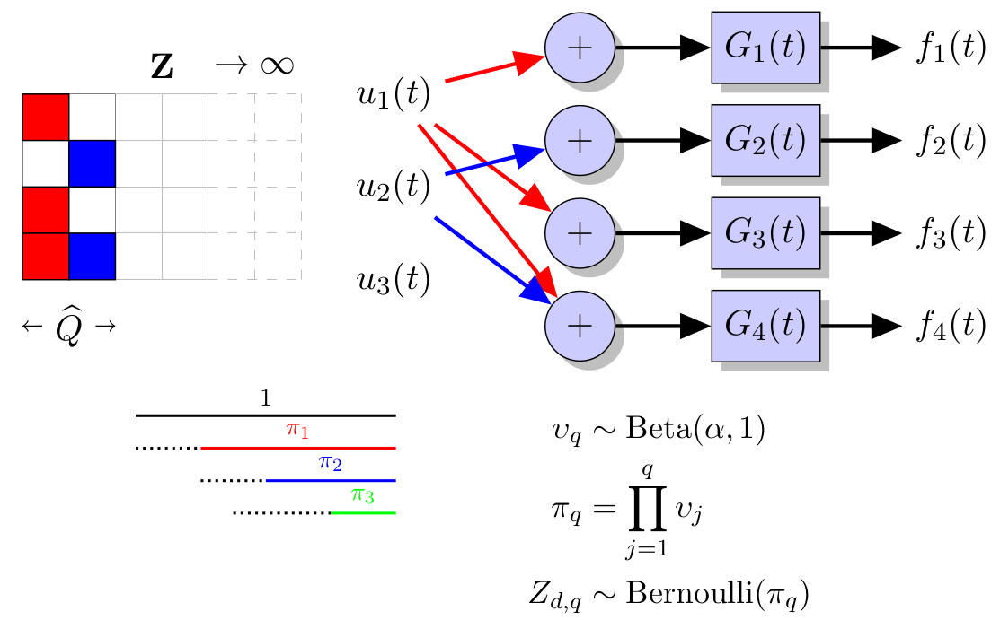

# IBPLFM: Indian Buffet Process for Latent Force Models
By Cristian Guarnizo (cdguarnizo@utp.edu.co) and Mauricio A. Álvarez (malvarez@utp.edu.co)

## Description
This code uses GPmat framework to calculate covariance functions
from Latent Force Models (LFMs).

By means of the Indian Buffet Process Prior it is posible to automatically
select the number of latent functions required to describe output data.
Additionally, the structure that represents the interconnection between
outputs and latent inputs is learned as well.

### Update
In order to achieve a tighter lower bound and to reduce the initialization sensitivity, the "spike and slab" prior and its variational variables were dropped out. We adopt this model as the default one.

### Demos
There are four different demos. From each demo we can learn three diferent probablistic models (Defaut: Using IBP prior to model the inteconnection matrix, "fixed": without the IBP prior, "old": Combination of the Spike and Slab and IBP priors [1,2])  
Toy: Toy dataset. MOCAP: Movement capture. Yeast: Gene expression data. Weather: Temperature data.

#### Acknowledgements

Thanks to the support from British Council and Colciencias under the research project “Sparse Latent Force Models for Reverse Engineering of Multiple Transcription Factors”.

#### References

[1] C. Guarnizo and M. A. Álvarez, "Indian Buffet process for model selection in convolved multiple-output Gaussian processes",
Available at: http://arxiv.org/abs/1503.06432

[2] C. Guarnizo, M. A. Álvarez and A. A. Orozco, "Indian Buffet Process for Model Selection in Latent Force Models",
Progress in Pattern Recognition, Image Analysis, Computer Vision, and Applications: 20th Iberoamerican Congress, CIARP 2015, Montevideo, Uruguay, November 9-12, 2015, 635-642.
Available at: http://link.springer.com/chapter/10.1007%2F978-3-319-25751-8_76
